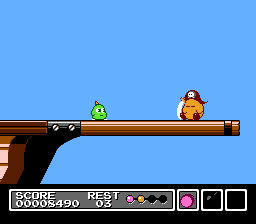

# Horizontal speed

Under normal conditions, the player's maximum horizontal speed is as follows (measured in 1/16ths of a pixel per frame):
- moving right on ground: alternates between 22 and 23 every frame
- moving left on ground: alternates between 23 and 24 every frame
- moving right in air: either 23 or 24 (depends on parity)
- moving left in air: either 24 or 25 (depends on parity)

"Parity" refers to whether or not the speed is even or odd. Since movement speed normally changes in multiples of 2 in the air, parity is generally fixed in the air and can only change from eg. moving on the ground or hitting a wall.

# Item drops

Item drops are not random. When an enemy is killed, it will drop an item if all of the following conditions are met:
- the enemy is set to give points when killed
- the tens and hundreds digits of the score are the same
- there is a free enemy slot to spawn the item into

The exact dropped item depends on the tens/hundreds digit of the score:
- 0 or 5 => health potion
- 2, 4, 6 or 8 => bomb
- 1, 3, 7 or 9 => fireball

# Hitbox bug

An analysis by becored can be found [here](https://becored.hatenablog.com/entry/2016/01/23/180603).

This bug allows for clipping into ceilings by jumping into them, as well as clipping into floors in specific circumstances (needs more research).

# Object slot limit

There are 10 slots (0 to 9) for enemies to exist in, with slot 0 being reserved for the player and slot 1 for the active star/bomb/fireball. This leaves slots 2-9 for enemies in the game to use. If all of these slots are occupied, no new enemies will be able to spawn. Combined with the fact that fireballs and bombs spawn many particles, which can occupy slots 2-8, it's possible to prevent some unexpected enemies from spawning, as can be seen [here](https://www.youtube.com/watch?v=8Tqw8Dx3KV8).

# Item bug
<video class="centered-image" autoplay muted loop><source src="resources/item_bug.webm" type="video/webm"></video>

By holding up and pressing down and B on the same frame, it's possible to use an item and switch items at the same time, causing the initially selected item to be used but the next item in the inventory to get used up. Unfortunately, holding up and down at the same time on a standard NES controller is generally not possible.

# Sleeping Pirate
{:class="centered-image"}

The Pirate boss in level 2 is intended to spawn in one of two ways; either sleeping next to an alarm clock Ohagi or immediately awake with no Ohagi. This depends on the 2-byte level timer ($ed-$ee), which tracks the number of frames that have passed since the start of the level. If the upper byte has a value of $10 or above (corresponding to 4096 frames or &#126;68 seconds having passed), the awake version of the boss will spawn; otherwise, it will be the asleep version. However, the use of the raw global timer value to determine the initial boss state has some interesting consequences.

Although the intent is likely to give the player motivation to play quickly, it's possible to encounter the boss while asleep even after 4096 frames have passed. The level timer can only count up to 65536 frames (~18 minutes and 10 seconds), after which it will loop back around. This means that every 65536 frames there is a 4096 frame window in which the boss will spawn asleep.

The Ohagi and Pirate each separately determine whether or not they should spawn, when the screen scrolls to their horizontal positions. If entering the room from the left side, this can lead to another strange situation, where the two enemies disagree on the initial state - either resulting in [an awake Pirate with an alarm clock Ohagi](https://clips.twitch.tv/StrongDrabSeahorseDuDudu-V5W0tvWAXT8tg_xp), or [a lone asleep Pirate](https://www.youtube.com/watch?v=Os0xfNiS8RQ). The former is not difficult to run into accidentally, but the latter relies on the level timer rolling over. This bug can be recreated either by timing the screen scroll into the boss room, or by timing a pause after the alarm clock has (tried to) spawn but before the Pirate has spawned.
