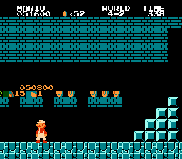
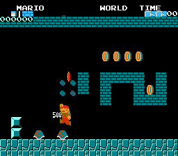
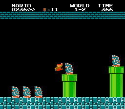
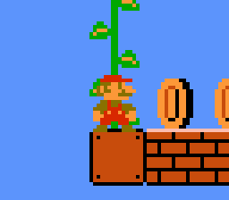

# VRAM buffer corruption
{:class="centered-image"}

As part of handling nametable (tilemap) and palette updates, Super Mario Bros. uses two buffers: `VRAM_Buffer1` (63 bytes of capacity) and `VRAM_Buffer2` (35 bytes). They are used to temporarily store these updates, as they cannot be handled immediately (while the current frame is being drawn) without visual glitches, only during vertical blanking (a period of time in between drawing frames during which no rendering happens). The second buffer is used for drawing new columns of the level, while the first is used for everything else.

The combination of a few factors allows for these buffers, as well as other data, to get corrupted in specific circumstances. First of all, they reside sequentially in memory:
- $300: `VRAM_Buffer1_Offset`, which tracks the length of the data currently in the buffer
- $301-$33f: `VRAM_Buffer1`
- $340: `VRAM_Buffer2_Offset`
- $341-$362: `VRAM_Buffer2`
- $363 onwards: other graphics-related data

Secondly, the buffer sizes are not that big compared to the sizes of their entries. For instance, hitting a single coin block uses up 24 bytes, to buffer updates to the coin block graphics as well as the visual coin and score counters.

A final detail, which is not crucial but makes the corruption easier to perform, is that every frame, only one of the 2 buffers gets handled and cleared out, while the other stays intact going into the next frame. If it is non-empty, `VRAM_Buffer2` takes priority, so loading in new columns of tiles at the right time can prolong the window in which you can add more entries to `VRAM_Buffer1` to multiple frames.

{:class="centered-image"}

One interesting effect can be seen in [this](https://www.youtube.com/watch?v=vcQw_NPFSsQ) movie by redatchyon2098, which towards the end causes a block graphics update, a coin and score counter update from breaking a brick, a coin and score counter update from collecting the coin, and an update to the blinking palette to all be pushed to the buffer on one frame, and two additional coin and score counter updates from the two koopas on the next frame. Because of `VRAM_Buffer2` priority, all of these end up residing in the buffer at once, totalling 73 bytes, which is more than the reserved 63 bytes. The 64th byte, #$02 (the second digit of the coin counter after the coin is collected), overwrites `VRAM_Buffer2_Offset`, and bytes 65 to 73 (which happen to exactly be the data for the last score counter update) along with a trailing 0 byte are placed at the start of `VRAM_Buffer2`. The next time a new column of tiles is to be drawn, data starts being written at offset 2 instead of offset 0. This replaces the usual score counter update length of 6 (for 6 significant score digits) with an erroenous 36, and so on the next frame, the score digits along with many tiles to the right of them (and also underneath, after wrapping around horizontally) get overwritten by the level tiles and other garbage tile data. One of the tiles that gets overwritten is the upper part of the blinking coin tile in the HUD, which is responsible for triggering sprite 0 hit, a feature of the NES that the game utilises for timing. It happens when a pixel being drawn contains both a non-transparent pixel of the first sprite (sprite 0) and a non-transparent pixel of a background tile. Because the coin tile gets replaced by a fully transparent tile, sprite 0 hit never happens, and the game gets stuck in an infinite loop.

{:class="centered-image"}

Another notable effect can be seen in [this](http://tasvideos.org/userfiles/info/63142191243839512) movie by HappyLee. The setup is very similar to the one described above, but not identical. This time, there is a timer update instead of a blinking palette update, which takes up 6 bytes, instead of 7. This places subsequent data differently, and a value of #$20 (the upper byte of a PPU address) is written to `VRAM_Buffer2_Offset`. Because of this, the next tile column update data begins 32 bytes into `VRAM_Buffer2`, going out of bounds and corrupting unrelated graphics data. `BowserGfxFlag` is set to #$24 as part of this. Whenever `BowserGfxFlag` is non-zero, most objects are drawn as the front half (if equal to 1) or back half (if greater than 1) of Bowsers. This flag is only intended to be used to handle drawing Bowser in castle stages.

Theoretically, in the best case, any byte from $363 to $444 can be written to with this bug. Although overwriting these bytes doesn't seem overly useful, to my knowledge there is no certainty on that. They are mostly related to graphics, but for instance `FirebarSpinSpeed` is also within this range.

Fun fact: while loading in a new area, `VRAM_Buffer2` gets filled up far beyond its usual capacity. This doesn't cause any problems, though, as the area of memory that's used gets cleared out afterwards, just before gameplay begins.
\
&nbsp;

# Fireballing objects at a wrong position
([video](https://www.youtube.com/watch?v=vhsuPO8oCtc))

For the first frame of an object's existence, it inherits the hitbox data (`EnemyBoundingBoxCoord`) and offscreen flag (`EnemyOffscrBitsMasked`) which already corresponded with its slot (either the data of the object that was previously loaded into that slot, or null values if the slot hasn't been filled since the start of the area). This is usually not a problem, as most of the time newly loaded objects also get `EnemyOffscrBitsMasked` set to a non-zero value, preventing collisions. However, Piranha Plants, Bullet Bills and Bowser Flames, which when appearing together with pipes / from Bullet Bill Cannons / from Bowsers have different spawn code, do not update this value immediately. If equal to 0, this allows for a fireball to hit one of these objects on the first frame, hitting its unintended, inherited hitbox. Note that these objects cannot hit the player in this way, as collision checks with the player begin one frame after the object has spawned.
\
&nbsp;

# Left + right
<video class="centered-image" autoplay muted loop><source src="resources/left_right.webm" type="video/webm"></video>

Whenever the player is holding left or right without holding down and also on the ground or swimming, the lowest 2 bits of the controller input data are copied over to `PlayerFacingDir`. The intended written values are 1 when facing right (the right button is bit 0) and 2 when facing left (the left button is bit 1). However, if both left and right are held at the same time (which is not usually possible on a NES controller), bit 0 and bit 1 will both be set, causing 3 to be written to `PlayerFacingDir`.

Another situation where the player's inputs can affect the player's facing direction is on a vine, with certain other conditions met. In that case, the lowest 2 bits of the controller data are flipped before being copied to `PlayerFacingDir`. This has the intended effect of making the player face left on a right press, and right on a left press, but by holding left+right you can use this to achieve a 4th direction value of 0.

Both 0 and 3 are not intended values for `PlayerFacingDir`, thus they cause some anomalies:
- Being on a vine places the player at an unintended horizontal offset from the vine due to out-of-bounds indexing, cancelling the climbing state (if the player has not climbed high enough to trigger the cutscene) and essentially teleporting the player. For most vines, the destination will be far right (direction 0) or inside the vine (direction 3), but for vines right at the start of a page boundary (such as in 4-2), an additional change to the player's page location causes the player to end up all the way to the left of the screen. 
- When holding left+right on the ground at near-standstill, `PlayerFacingDir` and `Player_MovingDir` are not equal, causing a constant horizontal speed reset, after which rightwards friction is applied due to holding right, finally resulting in a constant horizontal speed of 1 to the right.
- When slowing to a stop, ground deceleration is greater than 1 pixel/frame² regardless of movement direction, due to `PlayerFacingDir` and `Player_MovingDir` never being equal. This allows for the strange situation where `Player_X_Speed` alternates between 1 and -1 every other frame, instead of eventually settling to 0.
- The player always skids with direction 0, and never skids with direction 3.
- The player fires fireballs to the left even faster than with direction 2, due to out-of-bounds indexing for the fireball speed.
- The player's sprite looks strange underwater when off the ground.
- Various discrepancies between visual facing direction and expected behavior.
\
&nbsp;

# Broken warp zone scroll stop
<video class="centered-image" autoplay muted loop><source src="resources/scroll_stop.webm" type="video/webm"></video>

When a warp zone object (#$34) is loaded while `ScrollLock` is non-zero (which happens in 1-2 and 4-2 in the original game, slightly before the actual warp zones), it uses the player's vertical position to determine whether to keep the screen locked, or to let it scroll again and destroy itself. Presumably this is so that in the two aforementioned levels, the player won't be aware of anything notable existing beyond the ending pipe, unless they are above the top row of bricks. However, this check appears to be wrong.

The condition to unlock the screen is `Player_Y_Position` bitwise-ANDed with `Player_Y_HighPos` being equal to 0. The effect of this is that the screen gets unlocked as soon as either the player is above the top row of bricks (`Player_Y_HighPos` is 0), or the player's pixel position is even (`Player_Y_HighPos` is either 0 or 1 and the lowest bit of `Player_Y_Position` is 0). Because of this, the screen scroll stop usually only lasts for one frame or a few frames, and is only usually seen as a slight camera jitter. With specific movement, the screen lock can be [prolonged](https://www.youtube.com/watch?v=sRRZy3uyxCY), but since being on a block snaps the player's vertical pixel position to an even value, this cannot be done indefinitely.

The condition for the presumably intended effect should be either `Player_Y_Position` or `Player_Y_HighPos` being equal to 0. `Player_Y_Position` == 0 corresponds to the bottom of the player being level with the top row of bricks, and `Player_Y_HighPos` == 0 corresponds to positions above that. A rough patch for demonstration purposes, which almost applies this change but won't work properly while the player is airborne above the top row of bricks, can be applied with the game genie code `VKZUGN`.
\
&nbsp;

# Enemy change bug
<video class="centered-image" autoplay muted loop><source src="resources/enemy_change.webm" type="video/webm"></video>

When an enemy is either hit by a shell or by a block from underneath, The routine (`ChkToStunEnemies`) is run that handles enemies getting hit and jumping up. One of the things this routine is reponsible for is demoting Paratroopas to Koopas. It does this by checking to see if the hit enemy's ID is equal to #$9, #$d, #$e, #$f or #$10, and if so, bitwise-ANDs the ID with 1, preserving only the last bit. This results in the following enemy transformations:
- immobile green Paratroopa (#$9) -> red Koopa (#$1) (this enemy is unused)
- Piranha Plant (#$d) -> red Koopa (#$1) (this enemy does not get hit by shells or blocks)
- jumping green Paratroopa (#$e) -> green Koopa (#$0)
- flying red Paratroopa (#$f) -> red Koopa (#$1)
- flying green Paratroopa (#$10) -> green Koopa (#$0)

Presumably by mistake, `ChkToStunEnemies` is run twice in the case of enemies getting hit by blocks (except Hammer Brothers, which handle walking on blocks differently), and the second time the enemy's on-screen horizontal pixel position is compared to the above values instead of its ID. This means that any enemy that gets hit by a block at an x position of 14 or 16 becomes a green koopa, and at an x position of 9, 13 or 15 becomes a red koopa. All of these positions are near the left edge of the screen.
\
&nbsp;

# Incorrect player size (aka "small fire mario")
([video](https://www.youtube.com/watch?v=v2lVgHaRDf8))

Two variables control the player's powerup state:
- `PlayerStatus` (0 = no powerup, 1 = mushroom, 2 = fire flower)
- `PlayerSize` (0 = small, 1 = big)

There are 3 ways the player's powerup state is intended to change:
- No powerup → mushroom: `PlayerStatus` is changed from 0 to 1 and, after a delay, `PlayerSize` is flipped from 0 to 1.
- Mushroom → fire flower: `PlayerStatus` is changed from 1 to 2.
- Mushroom/fire flower → no powerup: `PlayerStatus` is changed from 1 or 2 to 0 and, after a delay, `PlayerSize` is flipped from 1 to 0.

In the first and third case, the delayed `PlayerSize` change happens as such: first, at the same time `PlayerStatus` is written to, a timer (`TimerControl`) starts counting down by 1 every frame from $ff. Then, normally, when that timer reaches $f8 (growing) or $f0 (shrinking), `PlayerSize` is XOR-ed with 1, flipping the value.

A problem arises when an axe is touched at the same time the player has a powerup and gets hit. `PlayerStatus` gets changed immediately and as intended, but the code to change `PlayerSize` when `TimerControl` has reached a certain value no longer gets run. Touching the axe causes the start of the end-of-castle cutscene, setting `OperMode` to 2 and stopping the handling of many gameplay events. Meanwhile, `TimerControl` ticks down to 0 during the cutscene and the "taking damage" state (`GameEngineSubroutine == 2`) is overridden before the start of the next level, and so the size change doesn't ever happen.

`PlayerStatus` and `PlayerSize` are always assumed to be in sync (either both equal to 0 or both non-zero), so there is nothing in place to check for or fix a desync. Taking damage at the same time as touching an axe creates a desync, where `PlayerStatus` is 0 but `PlayerSize` is 1. This desync persists through normal gameplay, because any time `PlayerSize` is changed, it is always flipped to the other value, rather than explicitly being set to the intended value. The final result of this is the following powerup progression for the player: big + no powerup → small + has mushroom → small + has fire flower. Performing the bug a second time sets everything back to normal, for similar reasons as before.
\
&nbsp;

# Powerup jump
When you collect a powerup that changes your powerup status, `Player_State` gets set to 0, meaning that even if you are in the air, you will actualy be considered to be on the ground for some checks. This stems from sharing code between the powering up animation and the death animation, the latter of which alters `Player_State` when making the player jump up upon death. After a frame of movement, `Player_State` gets updated to the correct value, but prior to that there is one frame where you can turn around or jump, even in the air. The jump can be buffered during the powering up animation, giving much more than a frame to perform this trick.
\
&nbsp;

# Standing inside vines/flags
{:class="centered-image"}

Vine/flag collision is determined by checking if the low nybble of the player's horizontal pixel position is equal to 6, 7, 8 or 9 while they are touching a climbable tile. In practice this means the collision happens if the player is offset by -10, -9, -8, -7, 6, 7, 8 or 9 pixels from the left side of the tile. This leaves a 12 pixel wide gap in which the player can be positioned without grabbing onto the vine/flag, in between the two 4 pixel wide collision areas. It's possible to enter this area by landing on the vine/flag from above, or by holding onto a vine with direction 3 (see the "Left + right" section). Although climbable tiles are usually solid, they are given an exception for foot collision, and so the player always falls through them instead of standing on them. The same applies for side collision, but not head collision.
\
&nbsp;

# Random number generation
Super Mario Bros. 1 uses a 7-byte / 56-bit linear feedback shift register (`PseudoRandomBitReg`) to generate random numbers, used for all pseudorandom events in the game. When the game is powered on or reset, the first byte gets initialized as $a5, and the rest as zeroes. After that, all 7 bytes are updated every frame as such: all 56 bits are first shifted to the right by 1 (with the rightmost bit being discarded), and the new leftmost bit 55 is set to bit 40 XOR bit 48.

Although 7 bytes is enough to store 2^56 different states, the random number generator loops after only 2^15 - 1 = 32767 iterations (and this loop is entered after 39 iterations from initialization). This is because the 15 most significant bits are enough to dictate the long-term future of the register.

The pseudorandom number is used in these instances:
- spawning and moving bubbles
- spawning Cheep Cheeps (both underwater and flying)
- spawning Bullet Bills from launchers
- spawning hammers by Hammer Bros and Bowsers
- spawning Spinies by Lakitus
- spawning Bowser flames (both from offscreen and from Bowsers' mouths)
- Podoboo movement
- Hammer Bro movement
- Blooper movement
- Bowser movement
